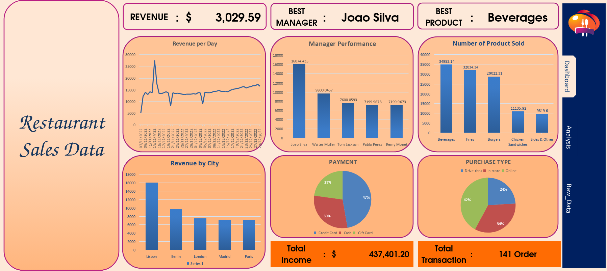
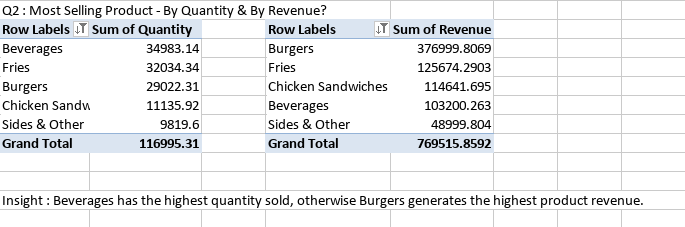

### **Restaurant Sales Data Analysis (Excel)**  
This project analyzes restaurant sales data using Microsoft Excel to uncover insights on revenue trends, product performance, and customer behavior.  
## Dashboard  
  
## Business Questions  
1. Most Preferred Payment Method  
2. Most Selling Product (by Quantity & Revenue)  
3. City & Manager with Maximum Revenue  
4. Date-wise Revenue  
5. Average Revenue  
6. Average Revenue (November & December)  
7. Standard Deviation of Revenue & Quantity  
8. Variance of Revenue & Quantity  
9. Revenue Trend (Increasing or Decreasing)  
10. Average Quantity & Revenue per Product  
## Key Insights  
- Credit Card is the most preferred payment method.  
- Burgers generate the highest revenue, while Beverages have the highest quantity sold.  
- Revenue shows an overall increasing trend over time.  
- Sales peak towards the end of December.  
## Analysis Process  
- Data cleaning (TRIM, handling blanks)  
- Pivot tables for aggregation  
- Charts for visualization  
- Dashboard creation in Excel  
  
## Tools Used  
- Microsoft Excel (Pivot Tables, Charts, Dashboard)  
## Dataset  
Dataset source: Kaggle    
https://www.kaggle.com/datasets/rohitgrewal/restaurant-sales-data  
   
